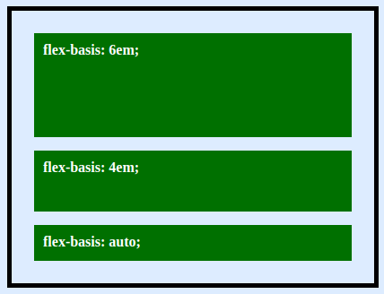

# CSS Flexbox
CSS Flexible Box Model (Flexbox) sangat efektif digunakan pada saat pembuatan *layout*, *position*, dan *align elements* yang dibungkus *dengan container*.

## The Main Axis and Cross Axis

Kita dapat menentukan arah Axis yang kita sedang gunakan dengan melihat property `flex-direction` yang defaultnya adalah `row`. Berikut adalah beberapa tips:
  - Jika setiap arah flex itemnya atau `flex-direction` ***perbaris / row*** maka Axisnya dari kiri ke kanan (**horizontal**).
  - Jika setiap arah flex itemnya atau `flex-direction` ***perkolom / column*** maka Axisnya dari atas ke bawah (**vertikal**).

## Flex Container
Pengaturan properties untuk element orang tua.
- Display  

Digunakan untuk mengaktifkan `flex` untuk setiap *child item*.  
  ```css
  .container {
    display: flex; /* or inline-flex */
  }
  ```

- Flex Direction  

Flex direction mengatur Main Axis kita yang sudah dijelaskan di awal.
  ```css
  .container {
    flex-direction: row | row-reverse | column | column-reverse;
  }
  ```
  - `row` (default): mengatur dari kiri ke kanan.
  - `row-reverse`: kebalikan dari `row`.
  - column: dari atas ke bawah.
  - column-reverse: kebalikan dari `column`.

- Flex Wrap  

Digunakan untuk membungkus flex item sehingga kita dapat mengatur baris atau kolom jika *screen size* kita dikecilkan.
  ```css
  .container {
    flex-wrap: nowrap | wrap | wrap-reverse;
  }
  ```
  - `nowrap` (default): semua flex items akan menjadi satu baris saja.
  - `wrap`: semua flex items akan dibungkus ke dalam beberapa baris dari atas ke bawah.
  - `wrap-reverse`: semua flex items akan dibungkus ke dalam beberapa baris dari bawah ke atas.

- Flex flow  
Cara cepat untuk mendeklarasikan property `flex-direction` dan `flex-wrap` secara bersamaan yang nilai defaultnya adalah `row nowrap`.
  ```css
  .container {
    flex-flow: column wrap;
  }
  ```

- Justify Content

Digunakan untuk meratakan flex items sesuai arah dari Main Axis.
  ```css
  .container {
    justify-content: flex-start | flex-end | center | space-between | space-around | space-evenly;
  }
  ```
  - `flex-start` (default): flex items diratakan sesuai posisi awal sesuai `flex-direction`.
  - `flex-end`: flex items diratakan sesuai posisi dari akhir sesuai `flex-direction`.
  - `center`: flex items diratakan di posisi tengah.
  - space-between: flex items diratakan dengan posisi pertama akan berada mepet di awal, posisi terakhir berada mepet di posisi akhir dan sisanya akan ratakan di tengah-tengah. 
  - `space-around`: flex items diratakan dengan jarak spasi antara antar itemsnya sama tetapi jarak awal dan akhir items tidak.
  - `space-evenly`: sama seperti `space-around` hanya saja jarak spasi pada awal dan akhir disamakan juga dengan jarak antara flex items-nya.

- Align Items  

Digaunakan untuk mengatur jarak sesuai dengan Cross Axis-nya.
  ```css
  .container {
    align-items: stretch | flex-start | flex-end | center | baseline;
  }
  ```
  - stretch (default): mengisi seluruh parent containernya sesuai dengan Cross Axis-nya.
  - flex-start: semua flex items berada menempel dengan awal Cross Axis-nya.
  - flex-end: semua flex items berada menempel dengan akhir Cross Axis-nya.
  - center: semua flex items berada ditengah sesuai Cross Axisnya.
  - baseline: semua flex items berada menyesuaikan dari isi contentnya dari flex item masing-masing.

- Align Content  

Membuat jarak spasi antara flex items sesuai dengan Cross Axis-nya. Hal ini sama dengan `justify-content` dengan Main Axis-nya.

  ```css
  .container {
    align-content: flex-start | flex-end | center | space-between | space-around | space-evenly | stretch;
  }
  ```
  - flex-start: tidak jarak spasi antara flex items dan berada menempel di awal sesuai  Cross Axis.
  - flex-end: tidak jarak spasi antara flex items dan berada menempel di akhir sesuai  Cross Axis.
  - center: tidak jarak spasi antara flex items dan berada menempel di tengah sesuai  Cross Axis.
  - space-between: flex items diratakan dengan posisi pertama akan berada mepet di awal, posisi terakhir berada mepet di posisi akhir dan sisanya akan ratakan di tengah-tengah sesuai dengan Cross Axis.
  - space-around: flex items diratakan dengan jarak spasi antara antar itemsnya sama tetapi jarak awal dan akhir items tidak sesuai Cross Axis.
  - space-evenly: sama seperti `space-around` hanya saja jarak spasi pada awal dan akhir disamakan juga dengan jarak antara flex items-nya sesuai Cross Axis.
  - stretch: akan mengisi sesuai containernya.

## Flex Items
Pengaturan properties element untuk anaknya.

- Order  

Mengatur urutan flex items. Nilai `order` terkecil akan berada di awal dan yang terbesar akan berada di akhir.
  ```css
  .item {
    order: 5; /* default is 0 */
  }
  ```

- Flex Grow  

Digunakan untuk **membesarkan** ukuran flex items dengan mengisi kekosongan jarak pada Main Axis pada parent container.  
Jika setiap flex items di set 1, maka setiap items akan memiliki ukuran yang sama pada sesuai dengan parent container.  
Jika salah satunya bernilai 2, maka ukuran item tersebut dua kalinya dari item lain.
  ```css
  .item {
    flex-grow: 4; /* default 0 */
  }
  ```

- Flex Shrink  
Digunakan untuk **mengecilkan** ukuran flex items. Semakin besar angka maka semakin menyusut ukurannya.
  ```css
  .item {
    flex-shrink: 3; /* default 1 */
  }
  ``` 

- Flex Basis  

Digunakan untuk mengatur ukuran awal setiap flex item.
  ```css
  .item {
    flex-basis: auto | content | <width> | <height>;
  }
  ```

- Flex  
Cara cepat untuk menuliskan `flex-grow`, `flex-shrink` dan `flex-basis` bersamaan. parameter kedua dan ketiga (flex-shrink and flex-basis) bersifat opsional. Nilai default-nya adalah `0 1 auto`, kita dapat menggantinya seperti `1 0`.
  ```css
  .item {
    flex: none | [ <'flex-grow'> <'flex-shrink'>? || <'flex-basis'> ]
  }
  ```
  Penggunaan Flex sangat direkomendasikan daripada melakukan pengaturan satu-satu di setiap flex item.

- Align self 
 
Digunakan saat kita ingin salah satu flex item memiliki properti yang berbeda dari yang lain.
  ```css
  .item {
    align-self: auto | flex-start | flex-end | center | baseline | stretch;
  }
  ```
  Catatan bahwa 
Note that `float`, `clear` dan `vertical-align` tidak dapat digunakan pada flex item.

## Source
- https://css-tricks.com/almanac/properties/f/flex-direction/
- https://css-tricks.com/almanac/properties/f/flex-wrap/
- https://css-tricks.com/almanac/properties/j/justify-content/
- https://css-tricks.com/almanac/properties/a/align-items/
https://css-tricks.com/almanac/properties/o/order/
- https://css-tricks.com/almanac/properties/f/flex-grow/
- https://css-tricks.com/almanac/properties/f/flex-shrink/
- https://css-tricks.com/almanac/properties/f/flex-basis/
- https://www.freecodecamp.org/news/flex-basis-property-in-flexbox/
- [https://www.youtube.com/watch?v=-DNLYk5uzl8](https://www.youtube.com/watch?v=-DNLYk5uzl8)
- [https://developer.mozilla.org/en-US/docs/Learn/CSS/CSS_layout/Flexbox](https://developer.mozilla.org/en-US/docs/Learn/CSS/CSS_layout/Flexbox)
- [https://css-tricks.com/snippets/css/a-guide-to-flexbox/](https://css-tricks.com/snippets/css/a-guide-to-flexbox/)