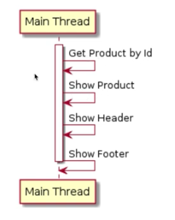
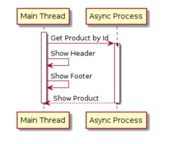
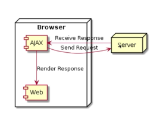
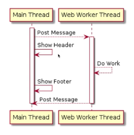

# Javascript Async

## Hal yang dipelajari
- Asynchronous
- Callback
- Ajax
- Promise
- Async Await
- Web Worker

## Apa Itu Synchronous dan Asynchronous?
- **Synchronous**  
  
  - Secara default, proses di Javascript dieksekusi secara Synchronous atau baris per baris. Artinya baris selanjutnya akan dieksekusi setelah baris sebelumnya selesai dikerjakan.
  - Proses Synchronous juga biasa disebut **Blocking**, karena harus menunggu tiap proses selesai, baru proses selanjutnya bisa dilakukan.
- **Asynchronous**  
  
  - Pada proses Asynchronous, Javascript tidak akan menunggu proses tersebut selesai, melainkan Javascript akan melanjutkan baris selanjutnya.
  - Proses Asynchronous biasa disebut **Non-Blocking**.

## Callback
- Merupakan mekanisme untuk memanggil kembali kode yang ada di program dari proses Asynchronous.
- Callback biasanya dibuat dalam bentuk function dan function tersebut akan dieksekusi saat proses Asynchronous selesai.
- Dengan menggunakan Callback, program bisa menerima informasi yang dibutuhkan dari proses yang berjalan secara Asynchronous.

## Beberapa Contoh Async Method
- `setTimeout(handler, time)`
  Digunakan untuk menjalankan proses Async sekali dalam waktu tertentu.
- `setInterval(handler, time)`
  Digunakan untuk menjalankan proses Async secara periodik dalam waktu tertentu.
- Contoh pada bagian ini ada pada `callback.html`

## Apa itu AJAX ?

- Ajax merupakan singkatan dari **Asynchronous JavaScript and XML**.
- Ajax digunakan untuk mengambil data dari server setelah halaman web tampil.
- Ajax dapat digunakan untuk mengubah tampilan web tanpa harus me-load ulang web.
- Ajax dapat mengirim data ke server secara Async di background.
- Kita tidak bisa langsung mengambil response Ajax karena proses AJAX adalah Async, sehingga kita harus menunggu sampai proses Async selesai.
- Contoh pada bagian ini ada pada `ajax.html`.
- Jangan lupa tambahkan eksetensi cors origin untuk chrome.

## AJAX Error Callback
- Pada proses AJAX terdapat hal-hal yang dapat mengganggu pemrosesan seperti, koneksi internet, error dari server, data client tidak valid, dsb.
- Hal tsb dapat di tangani pada kode program dengan menggunakan Error Callback di AJAX.
- Contoh pada bagian ini ada pada `ajax.html`.
- Untuk simulasi error ganti URL dengan yang salah.

## Promise
- Digunakan untuk menghindari *Callback Hell*.
- Promise merupakan proxy untuk sebuah nilai di masa depan (feture) yang belum diketahui saat pembuatan Promise tersebut.
- Contoh pada bagian ini ada pada `promise.html`.
- Jangan lupa tambahkan eksetensi cors origin untuk chrome.

## Promise Then, Catch dan Finally Method
- Promise `then` method digunakan sebagai callback ketika value pada Promise telah di resolve.
- Kita juga dapat membuat `then` chain method.
- Promise `catch` method digunakan sebagai Error callback untuk menghandle Error.
- Untuk melihat implementasi error kita dapat membuat salah URL-nya.
- Promise `finaly` method digunakan untuk mengeksekusi kode terlepas dari sukses atau tidaknya Promise tersebut.
- Contoh pada bagian ini ada pada `promise.html`.
- Jangan lupa tambahkan eksetensi cors origin untuk chrome.

## Promise All method
- Kadang kita perlu berhadapan dengan beberapa proses Async sekaligus.
- Promise `all` method bisa kita gunakan untuk menggabungkan beberapa Promise, menjadi Promise baru yang berisi data array hasil Promise-Promise tersebut.
- kerangka kode:
    ```js
    Promise.all([promise1, promise2, promise...])
      .then((values) => {
        // do something
      });
    ```
- Contoh pada bagian ini ada pada `promise.html`.
- Jangan lupa tambahkan eksetensi cors origin untuk chrome.

## Fetch API
- Fetch API menggantikan AJAX yang menggunakan callback.
- dokumentasi : [MDN Fetch API](https://developer.mozilla.org/en-US/docs/Web/API/Fetch_API/Using_Fetch)
- kerangka kode:
    ```js
    fetch(url, config)
      .then((response) => {

      })
      catch((err) => {

      })
    ```
- Contoh pada bagian ini ada pada `fetch.html`.
- Jangan lupa tambahkan eksetensi cors origin untuk chrome.

## Async Await
- Async digunakan untuk mendapatkan value hasil dari Function yang mengembalikan Promise.
- Await digunakan untuk mendapatkan value hasil dari Function yang mengembalikan Promise.
- Await hanya bisa digunakan dalam Async Function.
- Pada Async Await kita dapat menggunakan `try-catch` untuk Error Handler.
- Contoh pada bagian ini ada pada `async-await.html`.
- Jangan lupa tambahkan eksetensi cors origin untuk chrome.

## Web Worker


- JavaScript adalah Single Thread.
- Kemampuan satu Thread dalam mengelola beberapa pekerjaan, dinamakan ***Concurrent***.
- Contoh Concurrent seperti manusia yang sedang makan hanya bisa makan tetapi manusia dapat berpindah seperti menerima telpon sehingga makannya dipending dulu. Jadi suatu pekerjaan bisa switch ke pekerjaan lain.
- Kemampuan menjalankan beberapa Thread untuk mengelola satu atau lebih pekerjaan, dinamakan ***Paralel***.
- Untuk membuat proses secara Paralel, kita bisa menggunakan Web Worker (Modern Web Browser).
- Web Worker kemampuan untuk menjalankan proses di Thread yang berbeda dibanding Main Thread.
- Jika terdapat proses yang membutuhkan waktu lama, web tidak akan Freeze karena proses tersebut bisa kita jalankan di Thread yang berbeda dari Main Thread (yang biasa digunakan oleh UI).
- Contoh pada bagian ini ada pada `web-worker.html`.

## Web Worker Communication
- Web Worker menggunakan Proses Async dan untuk berkomunikasi kita menggunakan Event Listener.
- Untuk mengirim datake Web Worker atau Main Thread, kita dapat menggunakan method postMessage.

## Selanjutnya Bisa Mempelajari
- RxJS(Reactive Extensions Library for JavaScriipt)
- Web Socket
- Cara kerja Non-Blocking (low level)
